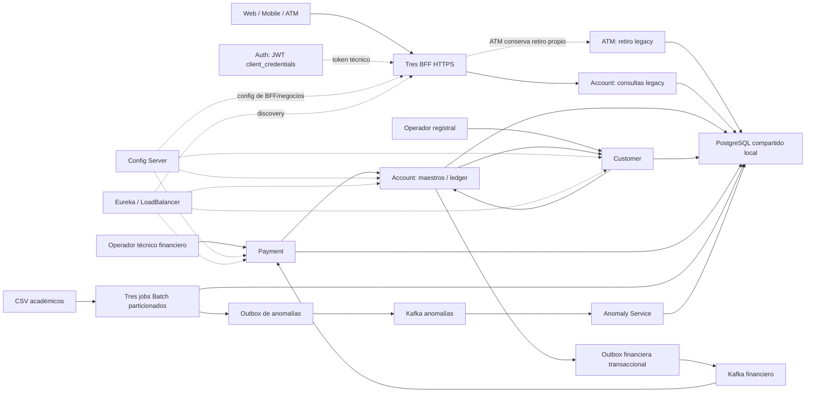

# Diagramas EFT

Tres diagramas funcionales Mermaid. Fuente editable para render posterior; no son imágenes ni PDF. La exportación y el tamaño se ajustarán a la plantilla docente cuando esté disponible.

## 1. Arquitectura general



No representa bases separadas físicamente ni autorización por titularidad implementada. BFF permanecen en el dominio legacy. Auth/Batch/Anomaly conservan configuración propia; no afirmar que todo usa Config/Eureka.

## 2. Payment → Account → Kafka → auditoría/reconciliación

```sequenceDiagram
    participant O as Operador técnico
    participant P as Payment
    participant A as Account
    participant D as PostgreSQL
    participant W as Publisher Account
    participant K as Kafka
    O->>P: POST + JWT + Idempotency-Key
    P->>D: Crear/leer operación PENDING por actor/key/hash
    P->>A: Posting con operationId y key; JWT relay
    A->>D: Tx: locks ordenados + saldo(s) + posting + outbox
    D-->>A: COMMIT
    A-->>P: Comprobante o replay inmutable
    P->>D: COMPLETED con comprobante
    P-->>O: 201 nuevo / 200 replay
    W->>D: Claim SKIP LOCKED + owner/token/lease
    D-->>W: Evento reclamado; sin lock durante red
    W->>K: Publicar evento con eventId
    K-->>W: Ack
    W->>D: PUBLISHED solo si ownership y lease válidos
    K->>P: Consumer group financial-payment-audit
    P->>D: Tx: audit dedup por eventId + reconciliar PENDING
    Note over P,A: Sin transacción ACID entre servicios
    Note over W,K: At-least-once; dedup lógica, no exactly-once físico
```

La respuesta HTTP y el evento pueden competir. Si se pierde la respuesta, Payment puede seguir PENDING; replay exacto o evento válido reconcilian sin mover fondos otra vez. Los mensajes inválidos se derivan a DLT.

## 3. Escalado local 2+2+2

```flowchart TB
    Discovery["Eureka: seis IDs/IPs distintos"]
    Client["Clientes LoadBalancer / runner discovery"]
    subgraph Customer["Customer x2"]
      C1["Customer 1"]
      C2["Customer 2"]
    end
    subgraph Account["Account x2"]
      A1["Account 1 + publisher"]
      A2["Account 2 + publisher"]
    end
    subgraph Payment["Payment x2"]
      P1["Payment 1 + consumer"]
      P2["Payment 2 + consumer"]
    end
    Client --> Discovery
    Discovery -.-> C1
    Discovery -.-> C2
    Discovery -.-> A1
    Discovery -.-> A2
    Discovery -.-> P1
    Discovery -.-> P2
    C1 --> DB["PostgreSQL: estado compartido / locks / lease"]
    C2 --> DB
    A1 --> DB
    A2 --> DB
    P1 --> DB
    P2 --> DB
    A1 --> K["Kafka: tres particiones"]
    A2 --> K
    K --> P1
    K --> P2
    BFF["BFF/Auth/Config/Eureka/DB/Kafka sin escalar"] -. "alcance" .-> Client
```

Durante la prueba ambos Account reclamaron filas distintas y los Payment compartieron un group. Un Payment superviviente recibió las tres particiones. Al finalizar se regresó a 1+1+1; no se afirma HA de PostgreSQL/Kafka ni un benchmark de capacidad.
