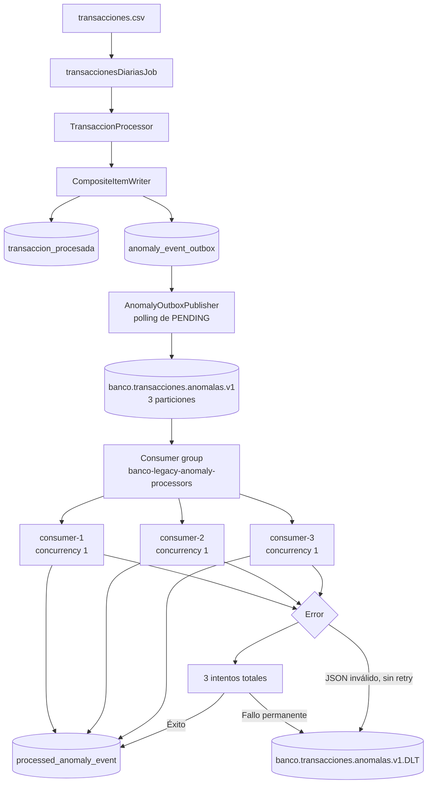
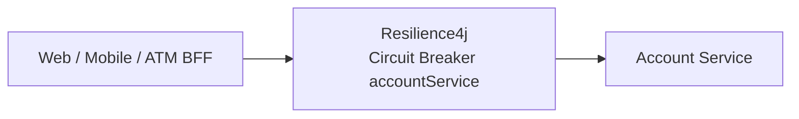

# Semana 7 — arquitectura orientada a eventos

Evidencia obtenida en entorno local los días 22 y 23 de septiembre de 2026.

## 1. Objetivo

Incorporar una arquitectura orientada a eventos para las anomalías detectadas por `transaccionesDiariasJob`, manteniendo intacto el resultado original del batch. Las anomalías se registran mediante una outbox transaccional, se publican en Apache Kafka y se procesan en un microservicio independiente. El retiro ATM permanece síncrono.

## 2. Arquitectura seleccionada

- **Apache Kafka:** desacopla productor y consumidor, conserva los eventos por partición y distribuye tres particiones entre procesos del mismo consumer group.
- **Evento de anomalía:** representa un hecho detectado por el batch; no transforma comandos bancarios sensibles en operaciones asíncronas.
- **Transactional Outbox:** `transaccion_procesada` y `anomaly_event_outbox` se escriben dentro de la misma transacción JDBC.
- **Publicador recuperable:** `AnomalyOutboxPublisher` consulta periódicamente registros `PENDING`; no depende de un callback al finalizar el job.
- **Consumer independiente:** `banco-legacy-anomaly-service` puede fallar, recuperarse y escalar sin alterar el procesamiento batch.
- **At-least-once e idempotencia:** Kafka puede redeliver; las restricciones por `eventId` y `transactionId` garantizan un único efecto persistido.

Saga no corresponde porque no existe una transacción distribuida que requiera compensaciones. Event Sourcing tampoco corresponde: las tablas existentes siguen siendo la fuente de verdad y Kafka sólo transporta la anomalía.

## 3. Diagrama Mermaid



Resilience4j constituye una capacidad separada del flujo Kafka:



## 4. Contrato de evento

El contrato compartido se encuentra en `banco-legacy-core/src/main/java/com/duoc/banco_legacy/core/event/AnomalousTransactionEvent.java`.

| Campo | Propósito |
|---|---|
| `eventId` | UUID del evento e identidad primaria para idempotencia |
| `correlationId` | Correlación con el job o la ejecución de evidencia |
| `eventVersion` | Versión del contrato |
| `occurredAt` | Timestamp UTC del evento |
| `transactionId` | Identidad de transacción y key Kafka |
| `transactionDate` | Fecha de la transacción |
| `amount` | Monto detectado |
| `transactionType` | Tipo de transacción |
| `anomalyReason` | Motivo de la anomalía |

Tópico principal: `banco.transacciones.anomalas.v1`. Kafka key: `transactionId` como texto. Dead Letter Topic: `banco.transacciones.anomalas.v1.DLT`.

## 5. Transactional Outbox

`JdbcWriterConfig` usa un `CompositeItemWriter`: el writer original conserva el resultado de negocio y `AnomalyOutboxItemWriter` agrega la intención de publicación en el mismo chunk transaccional. La fila nace con:

```text
status=PENDING publish_attempts=0 published_at=NULL last_error=NULL
```

Evidencia del evento real:

```text
eventId=14ec34b8-f459-4921-9f58-a795b07765a4
transactionId=971976 key=971976
topic=banco.transacciones.anomalas.v1 partition=0 offset=0
publishedAt=2026-09-22T23:56:47.793299Z
status=PUBLISHED published_at=NOT NULL last_error=NULL
```

El estado, los intentos y el último error son metadatos internos de la outbox y no se exponen en el payload del evento.

La recuperación se verificó con `KafkaRealOutboxIntegrationTests.conservaPendingAnteBrokerInaccesibleYRecuperaAlVolverLaConectividad`. Se usó el endpoint inaccesible `localhost:19093`; no fue un reinicio físico del broker:

```text
Endpoint inaccesible: publish_attempts=3 status=PENDING last_error=NOT NULL published_at=NULL
Siguiente polling contra localhost:9092: evento recibido; status=PUBLISHED;
publish_attempts=3 last_error=NULL published_at=NOT NULL
```

El polling vuelve a consultar registros `PENDING`, por lo que puede recuperar trabajo incluso después de reiniciar la aplicación.

## 6. Productor Kafka

`AnomalyOutboxPublisher` publica mediante `KafkaTemplate`, usando `transactionId` como key. La configuración del productor exige `acks=all` y habilita la idempotencia nativa del productor. La fila sólo cambia a `PUBLISHED` después de recibir metadata Kafka; un fallo conserva `PENDING` y registra el error.

La infraestructura local utiliza `apache/kafka:3.9.1`, modo KRaft, un nodo combinado broker/controller, sin ZooKeeper, listener Windows `localhost:9092` y healthcheck real del broker. La observación fue:

```text
banco-legacy-kafka: healthy
banco.transacciones.anomalas.v1: PartitionCount=3 ReplicationFactor=1
banco.transacciones.anomalas.v1.DLT: PartitionCount=3 ReplicationFactor=1
partitions=0,1,2 leader=1 replicas=1 ISR=1
```

Los tópicos se crean explícitamente mediante `kafka-topics.sh`; `auto.create.topics.enable=false`.

## 7. Consumer idempotente

`AnomalousTransactionListener` recibe el evento en `banco-legacy-anomaly-service` y `ProcessedAnomalyEventRepository` persiste el efecto. `processed_anomaly_event` define PK por `event_id` y unicidad por `transaction_id`.

```text
eventId=14ec34b8-f459-4921-9f58-a795b07765a4
transactionId=971976 topic=banco.transacciones.anomalas.v1
partition=0 offset=0 consumerInstance=real-consumer-evidence
Redelivery: partition=0 offset=1 outcome=DUPLICATE rowsAfterRedelivery=1
```

Otro `eventId` para el mismo `transactionId` también conserva una sola fila. El duplicado se considera procesado correctamente y no activa retry ni DLT.

## 8. Retry y DLT

`FixedBackOff(1000, 2)` representa un intento inicial y dos reintentos: tres intentos totales. Un fallo recuperable que tiene éxito en el tercer intento se persiste sin publicar en DLT.

Fallo permanente verificado:

```text
key=database-failure-fcb0c2f2 attempts=3 rows=0
originalTopic=banco.transacciones.anomalas.v1 originalPartition=0 originalOffset=1
dltTopic=banco.transacciones.anomalas.v1.DLT dltPartition=0 dltOffset=0
publicaciones DLT correspondientes=1
```

JSON inválido verificado:

```text
key=malformed-fcb0c2f2 attempts=1 businessInvocations=0
dltTopic=banco.transacciones.anomalas.v1.DLT dltPartition=1 dltOffset=1
evento válido posterior procesado: transactionId=920003
```

`ErrorHandlingDeserializer` evita invocar la lógica de negocio para el JSON inválido y permite continuar el loop. La DLT conserva key, payload y headers con la metadata de origen. Si falla la publicación en DLT, el registro no se considera recuperado.

## 9. Resilience4j

El Circuit Breaker `accountService` existente en Web, Mobile y ATM se conservó como evidencia independiente de tolerancia a fallos. En la regresión final se ejecutaron nuevamente:

```text
Web RemoteAccountServiceClientTests:    3 tests, 0 fallos
Mobile RemoteAccountServiceClientTests: 3 tests, 0 fallos
ATM RemoteAccountServiceClientTests:    3 tests, 0 fallos
```

Los casos verifican apertura ante fallos repetidos, fallbacks que no inventan datos o saldos y recuperación mediante una llamada de prueba exitosa. El recorrido demostrado es `CLOSED → OPEN → HALF_OPEN → CLOSED`. Esta es evidencia automatizada nueva de Semana 7; no se realizó una nueva interrupción live de Account Service y no se afirma evidencia live adicional.

## 10. Escalabilidad horizontal

La demostración utilizó el consumer group `banco-legacy-anomaly-processors`, tres particiones y tres procesos JVM independientes con `concurrency=1` por proceso.

| Instancia | Partición inicial | Eventos iniciales |
|---|---:|---:|
| `consumer-1` | 2 | 19 |
| `consumer-2` | 1 | 20 |
| `consumer-3` | 0 | 21 |

```text
60 eventos: rows=60 distinctTransactions=60 duplicates=0 lag=0 DLT=0
```

Después de detener deliberadamente `consumer-2`, ocurrió un rebalance y quedaron dos miembros activos para las tres particiones, con asignación 2+1. Las dos instancias restantes procesaron 12 eventos adicionales:

```text
consumer-1 / partition 0 = 2
consumer-1 / partition 1 = 6
consumer-3 / partition 2 = 4
rows=72 distinctTransactions=72 duplicates=0 consumers=3 partitions=3 DLT=0
```

El valor `consumers=3` de la consulta SQL final cuenta las tres instancias que participaron durante toda la ejecución; la vista de Kafbat posterior al rebalance muestra correctamente sólo dos miembros activos. Kafka distribuye particiones, no cantidades idénticas de mensajes; la evidencia demuestra procesamiento concurrente, rebalance y continuidad.

## 11. Evidencias

| Evidencia | Resultado observado |
|---|---|
| Broker y tópicos | Kafka healthy; tópico principal y DLT con 3 particiones y RF=1 |
| Outbox | `PENDING → PUBLISHED`, con key, partition, offset y timestamp |
| Recuperación | Tres fallos contra `localhost:19093`; registro pendiente recuperado en un polling posterior |
| Idempotencia | Redelivery en offset 1; `rowsAfterRedelivery=1` |
| Retry | Éxito recuperable en tercer intento, sin DLT |
| Fallo permanente | Tres intentos; una publicación DLT; cero filas de negocio |
| JSON inválido | DLT directa, una tentativa, cero invocaciones de negocio |
| Continuidad | Evento válido `transactionId=920003` procesado después del JSON inválido |
| Escalabilidad | 3 JVM × `concurrency=1`, distribución 19/20/21, rebalance 2+1, 72/72, duplicados 0, lag 0 |
| Resilience4j | 9 tests de cliente, 0 fallos; apertura y recuperación del Circuit Breaker |

Reproducción y verificación operativa:

```powershell
.\scripts\start-week7-kafka.ps1
.\mvnw.cmd -pl banco-legacy-anomaly-service -am package
.\scripts\start-week7-consumers.ps1 `
  -DatabaseUrl 'jdbc:postgresql://localhost:5432/banco_legacy' `
  -DatabaseUsername 'postgres' `
  -DatabasePassword '<valor-local>'
.\scripts\verify-week7.ps1
.\scripts\stop-week7-consumers.ps1
```

`verify-week7.ps1` es de sólo lectura: comprueba broker healthy, tópicos, tres particiones, RF=1, consumer group y lag cero cuando los servicios están disponibles.

Auditoría: no se versionaron JWT, claves privadas, keystores ni archivos `.env` de Semana 7. Las contraseñas PostgreSQL se reciben por parámetros o variables externas. El fallback `postgres` es exclusivamente académico y debe reemplazarse fuera del laboratorio. La contraseña temporal usada durante la demostración no está almacenada.

Trazabilidad de implementación:

```text
72c89ee Implementa transactional outbox para anomalías
14a5c3f Agrega infraestructura Kafka para Semana 7
11d8a01 Publica eventos de anomalías desde transactional outbox
b4648a2 Agrega consumidor idempotente de anomalías
9d99315 Agrega retry y DLT al consumidor de anomalías
1c15b37 Demuestra escalabilidad horizontal del consumidor Kafka
```

## 12. Resultado Maven

Regresión final del 23 de septiembre de 2026, con Kafka y PostgreSQL externos detenidos:

```text
Comando: .\mvnw.cmd clean verify
Reactor: 11 módulos
BUILD SUCCESS
Tests: 162
Failures: 0
Errors: 0
Skipped: 0
Total time: 02:28 min
```

La suite estándar no depende de Docker ni del broker Kafka externo; los tests Kafka automatizados usan infraestructura embebida.

## 13. Matriz de cumplimiento

| Criterio Semana 7 | Implementación | Archivos o clases principales | Evidencia | Estado |
|---|---|---|---|---|
| Arquitectura de eventos adecuada | Anomalía batch → outbox transaccional → Kafka → consumer idempotente | `JdbcWriterConfig`, `AnomalyOutboxItemWriter`, `AnomalyOutboxPublisher`, `AnomalousTransactionListener` | Transición outbox, recuperación, consumo e idempotencia | **Cumplido** |
| Diagrama de tópicos, mensajes y eventos | Mermaid, contrato y tópicos documentados | Este documento y `AnomalousTransactionEvent` | Diagramas y metadata 3xRF1 | **Cumplido** |
| Tolerancia a fallos mediante Resilience4j | Circuit Breaker `accountService` en Web, Mobile y ATM | Clientes remotos, configuración y tests | 9 tests y recorrido de estados documentado | **Cumplido** |
| Kafka funcional y escalable | Productor outbox, consumer, retry/DLT, 3 particiones, 3 JVM y rebalance | Batch, anomaly service, Compose y scripts | Evidencia funcional, 72 eventos y regresión de 162 tests | **Cumplido** |

## 14. Limitaciones

- La topología local utiliza un solo broker y replication factor 1; no representa alta disponibilidad del cluster.
- No existe exactly-once distribuido entre PostgreSQL y Kafka; la garantía es at-least-once con idempotencia del consumidor.
- La indisponibilidad Kafka del ensayo de recuperación se simuló mediante un endpoint inaccesible, no mediante un reinicio físico del broker.
- No se implementaron Saga, Event Sourcing, Kafka Streams ni Kubernetes.
- El retiro ATM permanece síncrono.
- No se añadió Schema Registry ni validación evolutiva externa del contrato.

## 15. Checklist de capturas

Las capturas fueron obtenidas manualmente durante ejecuciones reales, se adjuntan por separado dentro del paquete de entrega y no se versionan en Git. Este checklist describe las cinco áreas de evidencia sin enlazar archivos inexistentes:

1. Kafka healthy, tópico principal y DLT con `PartitionCount: 3` y `ReplicationFactor: 1`.
2. Outbox → Kafka → consumer: mismo `eventId`, key, tópico, partición y offset; transición `PUBLISHED` e idempotencia con `rowsAfterRedelivery=1`.
3. Retry/DLT: intentos 1–3, fallo permanente, JSON inválido, metadata DLT y procesamiento correcto de un evento posterior.
4. Escalabilidad y rebalance: tres consumers y tres particiones con lag 0; 60 eventos distribuidos 19/20/21; dos miembros activos después de detener `consumer-2`; reasignación 2+1; 12 eventos posteriores; 72 filas, 72 transacciones y 0 duplicados.
5. Resilience4j y build: configuración de `HALF_OPEN`; `OPEN → recuperación → CLOSED`; 9 tests Resilience4j verdes; Maven `BUILD SUCCESS`, 11 módulos, 162 tests y 0/0/0.

No deben aparecer contraseñas, variables JWT, tokens, claves ni payloads bancarios completos en las capturas.
